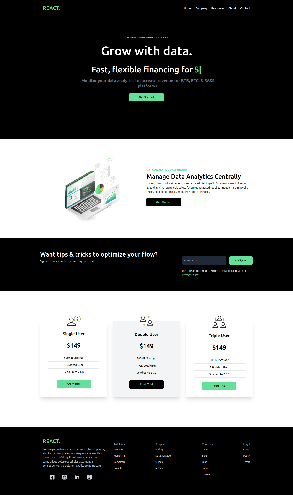

# Data Finance 📊💸

Welcome to **Data Finance**, your go-to application for optimizing financial data and analytics. 🚀 This React application provides a sleek and user-friendly interface to monitor and manage your data efficiently.



## 🎨 Features

- **Interactive Hero Section**: Engaging introduction with dynamic text animation. ✨
- **Analytics Dashboard**: Comprehensive data visualization and insights. 📈
- **Responsive Design**: Optimized for both desktop and mobile views. 📱💻
- **Newsletter Signup**: Stay updated with the latest tips and tricks. 📰

## 🚀 Getting Started

To get started with Data Finance, follow these steps:

1. **Clone the Repository**:

   ```bash
   git clone https://github.com/AnasHany2193/Data-Finance.git
   cd data-finance
   ```

2. **Install Dependencies**:

   ```bash
   npm install
   ```

3. **Start the Development Server**:

   ```bash
   npm start
   ```

   Your application will be running on `http://localhost:3000`.

4. **Build for Production**:

   ```bash
   npm run build
   ```

   This will create an optimized build of your application in the `build` directory.

## 🛠️ Technologies Used

- **React**: A JavaScript library for building user interfaces. ⚛️
- **Tailwind CSS**: A utility-first CSS framework for custom styling. 🌈
- **React Icons**: A library for using popular icons in React. 🖼️
- **React Typed**: For adding typewriting effects to your text. ⌨️

## Live Demo

Check out the live demo [here](https://data-finance-2193.netlify.app/)! 🚀

## 📧 Contact

For any questions or feedback, feel free to reach out:

- **LinkedIn**: [Anas Hany](https://www.linkedin.com/in/anashany219/)
- **GitHub**: [anashany2193](https://github.com/AnasHany2193)

Happy analyzing! 🌟
